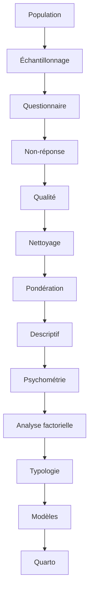

# Observatoire statistique des pratiques enseignantes

> **Important**
> Ce projet utilise des données simulées à des fins de démonstration méthodologique.
> Les résultats ne constituent pas des résultats officiels de la DEPP et ne décrivent pas la population réelle des enseignants.

## Présentation

Un démonstrateur de statistique publique qui relie conception d’enquête, production de données synthétiques, analyses et restitution automatisée. Il permet d’examiner les choix méthodologiques et leurs limites, du protocole au rapport destiné à un décideur.

Le [README historique](README_historique.md) conserve intégralement la documentation précédente.

## Problématique

Comment identifier et caractériser statistiquement différents profils de pratiques enseignantes et leurs associations avec les contextes professionnels ?

## Objectifs

Construire une enquête reproductible, contrôler la qualité, prendre en compte le sondage, examiner les échelles, décrire des profils et restituer des associations avec leur incertitude.

## Méthodologie



Ce schéma décrit les composantes de l’étude. Dans l’exécution informatique, la non-réponse est simulée avant les items pour identifier les répondants effectifs.

## Données

Population de 100 000 enseignants fictifs ; échantillon initial de 2 000. Les données individuelles et les sorties volumineuses sont exclues de Git et régénérées par R. Les paramètres sont des hypothèses techniques, jamais des statistiques officielles.

## Questionnaire

48 items ordinaux, six par dimension : EXP (explicitation), DIF (différenciation), EVA (évaluation formative), GCL (gestion de classe), COL (collaboration), NUM (numérique), DEV (développement professionnel), REL (relations éducatives). Faisabilité, priorité et quatre contrôles complètent l’instrument.

Voir le [questionnaire](questionnaire/questionnaire_complet.md) et le [dictionnaire](metadata/dictionnaire_variables.csv).

## Plan de sondage

Tirage aléatoire stratifié sans remise dans huit strates croisant degré, secteur et éducation prioritaire. Poids de base inverses des probabilités d’inclusion, correction de non-réponse et calibration sur les marges synthétiques connues. Voir le [plan](docs/plan_sondage.md).

## Analyses réalisées

Descriptions pondérées avec effectifs non pondérés, intervalles de confiance, diagnostics qualité, comparaisons de contextes, scores, profils et modèles. Les écarts priorité–pratique restent des écarts déclarés, sans preuve directe d’un besoin de formation.

## Psychométrie

Corrélations polychorïques, alpha, oméga, adéquation factorielle, analyse parallèle et analyse factorielle exploratoire avec rotation oblique. Les décisions combinent contenu et diagnostics ; les scores exigent un minimum d’items disponibles. La validation reste interne aux données simulées.

## Typologie

ACP exploratoire, CAH de Ward sur scores standardisés, comparaison de deux à six classes, silhouettes, sous-échantillonnages et comparaison avec k-means. La solution à deux profils décrit surtout un gradient de fréquence ; sa séparation et sa stabilité limitées interdisent de la traiter comme une classification naturelle.

## Modélisation

Régressions compatibles avec le design survey, coefficients et intervalles, diagnostics et sensibilités. Les associations ne sont pas causales ; les modèles de profils sont conditionnels à une typologie exploratoire.

## Résultats du démonstrateur

La réalisation documentée retrouve huit facteurs suggérés et deux profils exploratoires. L’intérêt principal réside dans la traçabilité des choix et la restitution des incertitudes. Les chiffres détaillés sont chargés automatiquement dans le rapport ; le README ne remplace pas les sorties recalculées.

## Reproductibilité

Graines fixées, paramètres versionnés, dépendances verrouillées avec renv, tests automatiques, journaux d’exécution et vérification des empreintes des résultats. Le premier calcul de l’analyse parallèle peut prendre plusieurs dizaines de minutes ; les caches ne sont réutilisés que si leurs clés concordent.

## Structure du dépôt

| Dossier | Contenu |
|---|---|
| `R/` | Scripts et fonctions réutilisables |
| `config/`, `metadata/` | Paramètres, dictionnaires et décisions |
| `data/` | Bases générées, exclues de Git |
| `outputs/` | Tables, figures, modèles et journaux générés |
| `tests/` | Tests et audits |
| `docs/`, `questionnaire/` | Documentation méthodologique |
| `reports/`, `presentation/` | Sources Quarto et script oral |

## Installation

R 4.6.0 et Quarto 1.10.18 ont été utilisés localement, avec Git et VS Code. Installer R, Quarto et Git puis restaurer les versions du verrou renv. Aucun fichier individuel n’est à télécharger.

## Exécution — Reproduire le projet

Dans un terminal :

```sh
git clone https://github.com/cmadjeki-dot/DEPP_B4_Pratiques_Enseignantes.git
cd DEPP_B4_Pratiques_Enseignantes
```

Ouvrir ce dossier dans VS Code et démarrer R à sa racine :

```r
renv::restore()
```

Puis dans un terminal où Rscript et Quarto sont accessibles :

Sous Windows/PowerShell, utiliser les paramètres régionaux testés avant de démarrer R :

```powershell
$env:LC_ALL = 'French_France.utf8'
$env:LANG = 'French_France.utf8'
```

```sh
Rscript R/00_run_all.R
quarto render
Rscript tests/run_tests.R
```

Le rendu précède ici les tests pour générer aussi les indicateurs de la note décideur. Le script maître lance les étapes dans des processus séparés, journalise leur statut et s’arrête au premier échec. Consulter `outputs/pipeline_execution_log.txt` et les journaux détaillés. Ne pas continuer après une erreur.

| Script | Fonction |
|---|---|
| `01_population.R` | Population synthétique |
| `02_sampling.R` | Échantillonnage |
| `03_nonresponse.R` | Non-réponse |
| `04_questionnaire_simulation.R` | Questionnaire |
| `05_quality.R` | Contrôle qualité |
| `06_cleaning.R` | Nettoyage |
| `07_weighting.R` | Pondération |
| `08_descriptive.R` | Descriptif |
| `09_psychometrics.R` | Psychométrie |
| `10_factor_analysis.R` | Analyse factorielle |
| `11_clustering.R` | Typologie |
| `12_models.R` | Modèles |
| `13_outputs.R` | Sorties finales |

Le maître inclut aussi les audits de population/poids, l’introduction des imperfections et l’assemblage de la base brute.

## Rapport

[Rapport scientifique](reports/rapport_scientifique.qmd), [annexes](reports/annexes.qmd), [note décideur](reports/note_decideur.qmd) et [présentation](presentation/presentation_depp_b4.qmd). Les HTML sont générés dans `_site/`. Le statut de publication est consigné dans la [checklist](docs/checklist_publication.md).

## Limites

Données entièrement simulées, dépendances imposées par hypothèses, pratiques autodéclarées, absence de causalité, plan et non-réponse simplifiés, absence de validation externe, classification sensible aux choix. Ce projet illustre une démarche ; il ne produit aucune connaissance empirique sur les enseignants réels.

## Auteur

Compte GitHub : [cmadjeki-dot](https://github.com/cmadjeki-dot). Projet personnel de démonstration méthodologique, sans affiliation institutionnelle revendiquée.
